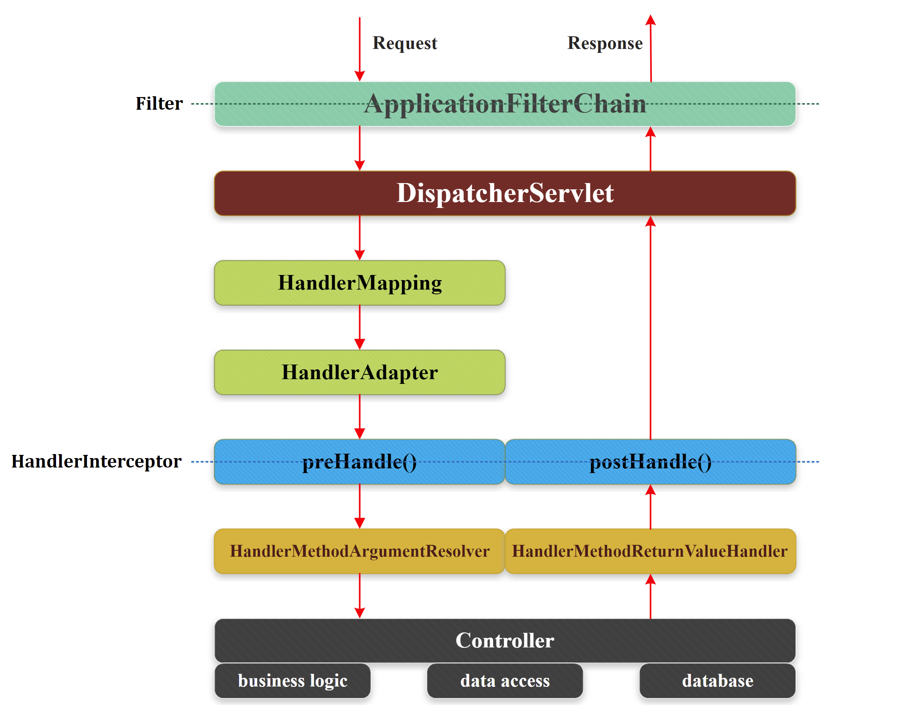

<p align="center">
<a href="https://openjdk.java.net/"></a>
<a href="https://www.apache.org/licenses/LICENSE-2.0.html"></a>
<a href="https://search.maven.org/search?q=a:easyexcel-spring-boot-starter"></a>
<a href="https://github.com/dk900912/easyexcel-spring-boot/releases"></a>
<a href="https://github.com/dk900912/easyexcel-spring-boot/stargazers"></a>
<a href="https://github.com/dk900912/easyexcel-spring-boot/fork"></a>
<a href="https://github.com/dk900912/easyexcel-spring-boot/issues"></a>
<a href="https://github.com/dk900912/easyexcel-spring-boot/graphs/contributors"></a>
<a href="https://github.com/dk900912/easyexcel-spring-boot"></a>
</p>


# 虽然 EasyExcel 很香，但别再自己手写读写逻辑了
`EasyExcel`是一款由阿里开源的 Excel 处理工具。相较于原生的`Apache POI`，它可以更优雅、快速地完成 Excel 的读写功能，同时更加地节约内存。即使 EasyExcel 已经很优雅了，但面向 Excel 文档的读写逻辑几乎千篇一律，笔者索性将这些模板化的逻辑抽离出来，该组件已经发布到 maven 中央仓库，感兴趣的朋友可以体验一下。
## 1 快速上手
### 1.1 引入依赖
```xml
<dependency>
	<groupId>io.github.dk900912</groupId>
	<artifactId>easyexcel-spring-boot-starter</artifactId>
	<version>0.0.6</version>
</dependency>
```
### 1.2 导入与导出
```java
@RestController
@RequestMapping(path = "/easyexcel")
public class ExcelController {

    @PostMapping(path = "/v1/upload")
    public ResponseEntity<String> v1upload(
            @RequestExcel(sheets = {
                    @Sheet(index = 0, headClazz = User.class, headRowNumber = 1),
                    @Sheet(index = 1, headClazz = User.class, headRowNumber = 1),
                    @Sheet(index = 2, headClazz = User.class, headRowNumber = 1)}
            )
            @Validated List<List<User>> users) {
        return ResponseEntity.ok("OK");
    }

    @PostMapping(path = "/v2/upload")
    public ResponseEntity<String> v2upload(
            @RequestExcel(sheets = {
                    @Sheet(index = 0, headClazz = User.class, headRowNumber = 1),
                    @Sheet(index = 1, headClazz = Admin.class, headRowNumber = 1)}
            )
            @Validated List<List<Object>> data) {
        return ResponseEntity.ok("OK");
    }

    @ResponseExcel(
            name="程序猿",
            sheets = {
                    @Sheet(name = "sheet-0", headClazz = User.class),
                    @Sheet(name = "sheet-1", headClazz = User.class),
                    @Sheet(name = "sheet-2", headClazz = User.class)
            },
            suffix = ExcelTypeEnum.XLSX)
    @GetMapping(path = "/v1/export")
    public List<List<User>> v1export() {
        List<User> userList = Lists.newArrayList();
        for (int i = 0; i < 10000; i++) {
            User user = User.builder().name("暴风赤红" + (i+1))
                    .birth(LocalDate.now()).address("江苏省苏州市科技城昆仑山路58号").sex(Sex.MALE)
                    .build();
            userList.add(user);
        }
        return ImmutableList.of(userList, userList, userList);
    }

    @ResponseExcel(
            name="程序猿",
            sheets = {
                    @Sheet(name = "sheet-0", headClazz = User.class),
                    @Sheet(name = "sheet-1", headClazz = Admin.class)
            },
            suffix = ExcelTypeEnum.XLS)
    @GetMapping(path = "/v2/export")
    public List<List<?>> v2export() {
        List<User> userList = Lists.newArrayList();
        List<Admin> adminList = Lists.newArrayList();
        for (int i = 0; i < 10000; i++) {
            User user = User.builder().name("暴风赤红" + (i+1))
                    .birth(LocalDate.now()).address("江苏省苏州市科技城昆仑山路58号").sex(Sex.MALE)
                    .build();
            userList.add(user);
            Admin admin = Admin.builder().name("擎天柱" + (i+1))
                    .birth(LocalDate.now()).address("江苏省苏州市科技城昆仑山路68号").sex(Sex.MALE)
                    .build();
            adminList.add(admin);
        }

        List<List<?>> responseData = Lists.newArrayList();
        responseData.add(userList);
        responseData.add(adminList);

        return responseData;
    }

    @ResponseExcel(name="templates/tem.xlsx", scene = TEMPLATE)
    @GetMapping(path = "/v1/template")
    public void template() {}
}
```
## 2 实现原理
一切 Java 程序都是基于 Thread 的，当一个 HTTP 请求到达后，Servlet Container 会从其线程池中捞出一个线程来处理该 HTTP 请求。具体地，该 HTTP 请求首先到达 Servlet Container 的`FilterChain`中；然后，FilterChain 将该 HTTP 请求委派给`DispatcherServlet`处理，而 DispatcherServlet 恰恰就是 Spring MVC 的门户。在 Spring MVC 中，所有 HTTP 请求都由 DispatcherServlet 进行路由分发。大致流程下图所示。

]

DispatcherServlet 在 HandlerMapping 的帮助下可以快速匹配到最终的 Controller，由于 Controller 大多由`@RequestMapping`注解标注，那么`RequestMappingHandlerMapping`最终脱颖而出。RequestMappingHandlerMapping 会将 HTTP 请求映射到一个`HandlerExecutionChain`实例中，每一个 HandlerExecutionChain 实例的内部维护了`HandlerMethod`和`List<HandlerInterceptor>`。其中，HandlerMethod 实例持有一个`Object`类型的 bean 变量和`java.lang.reflect.Method`类型的 method 变量，bean 和 method 这俩成员变量组合起来最终可以确定究竟由哪一个 Controller 中的某一方法来处理当前 HTTP 请求。

此时已经知道目标方法了，那直接反射执行目标方法？是不可以的，因为通过反射来执行目标方法需要有参数才行，此外还需要对目标方法的执行结果进行加工处理。既然 HandlerMapping 没有解析请求体和处理目标执行结果的能力，只能再引入一层适配器了，它就是 HandlerAdapter。在 Spring MVC 所提供的若干种 HandlerAdapter 中，能够适配 HandlerMethod 的只有`RequestMappingHandlerAdapter`；RequestMappingHandlerAdapter 实现了`InitializingBean`接口，用于初始化`HandlerMethodArgumentResolverComposite`类型的 argumentResolvers 成员变量和`HandlerMethodReturnValueHandlerComposite`类型的 returnValueHandlers 成员变量，Composite 后缀表明这俩成员变量均是一种复合类，argumentResolvers 持有数十种`HandlerMethodArgumentResolver`类型的方法参数解析器，而 returnValueHandlers 则持有数十种`HandlerMethodReturnValueHandler`类型的方法返回值解析器。

重点来了！首先，我们需要一个实现 HandlerMethodArgumentResolver 接口的方法参数解析器，该解析器主要用于解析`@RequestExcel`注解，以读取 Excel 文档；此外，我们还需要一个实现 HandlerMethodReturnValueHandler 接口的方法返回值解析器，该解析器主要用于解析`@ResponseExcel`注解，以将目标方法所返回的数据写入到 Excel 文档中；最后，将这两个自定义的解析器分别添加到 RequestMappingHandlerAdapter 中的 argumentResolvers 与 returnValueHandlers 这俩成员变量中。

在 Spring MVC 中，由`RequestResponseBodyMethodProcessor`负责处理`@RequestBody`与`@ResponseBody` 注解。基于这一事实，笔者也没有单独设计两个解析器来分别应对 @RequestExcel 与 @ResponseExcel 注解，而是合二为一。

### 2.1 @RequestExcel 与 @ResponseExcel 解析器
```java
public class RequestResponseExcelMethodProcessor implements HandlerMethodArgumentResolver,
        HandlerMethodReturnValueHandler {

    private static final String RESPONSE_EXCEL_CONTENT_TYPE =
            "application/vnd.openxmlformats-officedocument.spreadsheetml.sheet";

    private static final String RESPONSE_EXCEL_CONTENT_DISPOSITION = "Content-disposition";

    private static final String RESPONSE_EXCEL_ATTACHMENT = "attachment;filename=";

    private static final String EXCEL_TYPE_HEADER = "excel-type";

    private static final Set<String> LEGAL_EXCEL_ENUM = Arrays.stream(ExcelTypeEnum.values())
            .map(ExcelTypeEnum::name)
            .collect(Collectors.toSet());

    private final ResourceLoader resourceLoader;

    public RequestResponseExcelMethodProcessor(ResourceLoader resourceLoader) {
        this.resourceLoader = resourceLoader;
    }

    @Override
    public boolean supportsParameter(MethodParameter parameter) {
        return parameter.hasParameterAnnotation(RequestExcel.class);
    }

    @Override
    public boolean supportsReturnType(MethodParameter returnType) {
        return returnType.hasMethodAnnotation(ResponseExcel.class);
    }

    /**
     * Resolve the uploaded excel into {@code List<List<>>}
     *
     * @param parameter the method parameter to resolve. This parameter must
     * have previously been passed to {@link #supportsParameter} which must
     * have returned {@code true}.
     * @param mavContainer the ModelAndViewContainer for the current request
     * @param webRequest the current request
     * @param binderFactory a factory for creating {@link WebDataBinder} instances
     * @return the resolved argument value, or {@code null} if not resolvable
     * @throws Exception in case of errors with the preparation of argument values
     */
    @Override
    public Object resolveArgument(MethodParameter parameter, ModelAndViewContainer mavContainer,
                                  NativeWebRequest webRequest, WebDataBinderFactory binderFactory) throws Exception {
        parameter = parameter.nestedIfOptional();
        Object data = readWithMessageConverters(webRequest, parameter);

        validateIfNecessary(data, parameter);

        return data;
    }

    /**
     * Generate excel by the given return value
     *
     * @param returnValue the value returned from the handler method
     * @param returnType the type of the return value. This type must have
     * previously been passed to {@link #supportsReturnType} which must
     * have returned {@code true}.
     * @param mavContainer the ModelAndViewContainer for the current request
     * @param webRequest the current request
     * @throws Exception if the return value handling results in an error
     */
    @Override
    public void handleReturnValue(Object returnValue, MethodParameter returnType,
                                  ModelAndViewContainer mavContainer, NativeWebRequest webRequest) throws Exception {
        // There is no need to render view
        mavContainer.setRequestHandled(true);
        writeWithMessageConverters(returnValue, returnType, webRequest);
    }

    // +----------------------------------------------------------------------------+
    // |                            private method for read                         |
    // +----------------------------------------------------------------------------+

    protected Object readWithMessageConverters(NativeWebRequest webRequest, MethodParameter parameter)
            throws IOException, UnsatisfiedMethodSignatureException {
        validateArgParamOrReturnValueType(parameter);

        HttpServletRequest servletRequest = webRequest.getNativeRequest(HttpServletRequest.class);
        Assert.state(servletRequest != null, "No HttpServletRequest");

        return readWithMessageConverters(servletRequest, parameter);
    }

    protected Object readWithMessageConverters(HttpServletRequest servletRequest, MethodParameter parameter)
            throws IOException {

        ExcelTypeEnum excelTypeEnum = getExcelTypeFromUploadedFile(servletRequest);

        RequestExcelInfo requestExcelInfo =
                new RequestExcelInfo(parameter.getParameterAnnotation(RequestExcel.class));
        InputStream inputStream;
        if (servletRequest instanceof MultipartRequest) {
            // Since Java 11, you could construct an empty InputStream by InputStream.nullInputStream()
            inputStream = ((MultipartRequest) servletRequest)
                    .getMultiFileMap()
                    .values()
                    .stream()
                    .flatMap(Collection::stream)
                    .findFirst()
                    .map(multipartFile -> {
                        try {
                            return multipartFile.getInputStream();
                        } catch (IOException e) {
                            return null;
                        }
                    })
                    .orElse(new ByteArrayInputStream(new byte[0]));
        } else {
            inputStream = servletRequest.getInputStream();
        }

        CollectorReadListener collectorReadListener = new CollectorReadListener();
        try (ExcelReader excelReader = EasyExcel.read(inputStream).excelType(excelTypeEnum).build()) {
            List<ReadSheet> readSheetList = requestExcelInfo.getSheetInfoList()
                    .stream()
                    .map(sheetInfo -> EasyExcel.readSheet(sheetInfo.getIndex())
                            .head(sheetInfo.getHeadClazz())
                            .registerReadListener(collectorReadListener)
                            .build()
                    )
                    .collect(Collectors.toList());
            excelReader.read(readSheetList);
        }

        return collectorReadListener.groupByHeadClazz();
    }

    protected void validateIfNecessary(Object data, MethodParameter parameter) throws ExcelCellContentNotValidException {
        if (parameter.hasParameterAnnotation(Validated.class)
                || parameter.hasParameterAnnotation(Valid.class)) {
            @SuppressWarnings("unchecked")
            List<Object> flattenData = ((List<List<Object>>) data).stream()
                    .flatMap(Collection::stream)
                    .collect(Collectors.toList());
            for (Object target : flattenData) {
                Set<ConstraintViolation<Object>> constraintViolationSet = ValidationUtil.validate(target);
                if (CollectionUtils.isNotEmpty(constraintViolationSet)) {
                    String errorMsg = constraintViolationSet.stream()
                            .map(ConstraintViolation::getMessage)
                            .distinct()
                            .findFirst()
                            .orElse("Invalid cell content");
                    throw new ExcelCellContentNotValidException(errorMsg);
                }
            }
        }
    }

    // +----------------------------------------------------------------------------+
    // |                            private method for write                        |
    // +----------------------------------------------------------------------------+

    protected void writeWithMessageConverters(Object value, MethodParameter returnType, NativeWebRequest webRequest)
            throws IOException, HttpMessageNotWritableException, UnsatisfiedMethodSignatureException, RedundantSheetAnnotationException {

        HttpServletResponse response = webRequest.getNativeResponse(HttpServletResponse.class);
        Assert.state(response != null, "No HttpServletResponse");

        ResponseExcelInfo responseExcelInfo =
                new ResponseExcelInfo(returnType.getMethodAnnotation(ResponseExcel.class));
        final String fileName = responseExcelInfo.getName();
        response.setContentType(RESPONSE_EXCEL_CONTENT_TYPE);
        response.setCharacterEncoding(StandardCharsets.UTF_8.name());
        if (TEMPLATE.equals(responseExcelInfo.getScene())) {
            response.setHeader(RESPONSE_EXCEL_CONTENT_DISPOSITION,
                    RESPONSE_EXCEL_ATTACHMENT + URLEncoder.encode(
                            fileName.substring(fileName.indexOf("/") + 1), StandardCharsets.UTF_8.name()));
            BufferedInputStream bufferedInputStream =
                    new BufferedInputStream(resourceLoader.getResource(CLASSPATH_URL_PREFIX + fileName).getInputStream());
            BufferedOutputStream bufferedOutputStream = new BufferedOutputStream(response.getOutputStream());
            FileCopyUtils.copy(bufferedInputStream, bufferedOutputStream);
        } else {
            Assert.notNull(value, "The method annotated with @ResponseExcel can not return null in non-template mode");
            validateArgParamOrReturnValueType(returnType);

            response.setHeader(RESPONSE_EXCEL_CONTENT_DISPOSITION,
                    RESPONSE_EXCEL_ATTACHMENT + URLEncoder.encode(
                            fileName, StandardCharsets.UTF_8.name()) + responseExcelInfo.getSuffix().getValue());
            try (ExcelWriter excelWriter = EasyExcel.write(response.getOutputStream())
                    .charset(StandardCharsets.UTF_8).excelType(responseExcelInfo.getSuffix()).build()) {
                List<WriteSheet> writeSheetList = responseExcelInfo.getSheetInfoList()
                        .stream()
                        .map(sheetInfo -> EasyExcel.writerSheet(sheetInfo.getName())
                                .head(sheetInfo.getHeadClazz())
                                .build()
                        )
                        .collect(Collectors.toList());
                @SuppressWarnings("unchecked")
                List<List<Object>> multiSheetData = (List<List<Object>>) value;

                validateRedundantSheetAnnotation(writeSheetList, multiSheetData);

                for (int i = 0; i < writeSheetList.size(); i++) {
                    WriteSheet writeSheet = writeSheetList.get(i);
                    List<Object> singleSheetData = multiSheetData.get(i);
                    excelWriter.write(singleSheetData, writeSheet);
                }
            }
        }
    }

    // +----------------------------------------------------------------------------+
    // |                            common private method                           |
    // +----------------------------------------------------------------------------+

    private void validateArgParamOrReturnValueType(MethodParameter target) throws UnsatisfiedMethodSignatureException {
        ResolvableType resolvableType = ResolvableType.forMethodParameter(target);
        boolean outerList = Optional.<Class<?>>ofNullable(resolvableType.resolve())
                .map(List.class::isAssignableFrom)
                .orElse(false);
        if (!outerList) {
            throw new UnsatisfiedMethodSignatureException(
                    "@RequestExcel or @ResponseExcel must be annotated with List<List<>>");
        }
        boolean innerList = Optional.<ResolvableType>of(resolvableType.getGeneric(0))
                .map(ResolvableType::resolve)
                .map(List.class::isAssignableFrom)
                .orElse(false);
        if (!innerList) {
            throw new UnsatisfiedMethodSignatureException(
                    "@RequestExcel or @ResponseExcel must be annotated with List<List<>>");
        }
    }

    private void validateRedundantSheetAnnotation(@NotNull List<WriteSheet> writeSheetList, @NotNull List<List<Object>> multiSheetData)
            throws RedundantSheetAnnotationException {
        if (writeSheetList.size() > multiSheetData.size()) {
            throw new RedundantSheetAnnotationException("Redundant @Sheet annotation in @ResponseExcel");
        }
    }

    private ExcelTypeEnum getExcelTypeFromUploadedFile(HttpServletRequest servletRequest) {
        String excelType = servletRequest.getHeader(EXCEL_TYPE_HEADER);
        Assert.notNull(excelType, "The excel-type was absent in request header");
        Assert.isTrue(LEGAL_EXCEL_ENUM.contains(excelType.toUpperCase()), "Illegal excel-type in request header");
        return ExcelTypeEnum.valueOf(excelType.toUpperCase());
    }
}
```
### 2.2 RequestMappingHandlerAdapter 后置处理器
```java
public class RequestMappingHandlerAdapterPostProcessor implements BeanPostProcessor,
        PriorityOrdered, ResourceLoaderAware {

    private ResourceLoader resourceLoader;

    @Override
    public Object postProcessAfterInitialization(Object bean, String beanName) throws BeansException {
        if (!supports(bean)) {
            return bean;
        }

        RequestMappingHandlerAdapter requestMappingHandlerAdapter = (RequestMappingHandlerAdapter) bean;
        List<HandlerMethodArgumentResolver> argumentResolvers = requestMappingHandlerAdapter.getArgumentResolvers();
        List<HandlerMethodReturnValueHandler> returnValueHandlers = requestMappingHandlerAdapter.getReturnValueHandlers();
        Assert.notEmpty(argumentResolvers,
                "RequestMappingHandlerAdapter's argument resolver is empty, this is illegal state");
        Assert.notEmpty(returnValueHandlers,
                "RequestMappingHandlerAdapter's return-value handler is empty, this is illegal state");

        List<HandlerMethodArgumentResolver> copyArgumentResolvers = new ArrayList<>(argumentResolvers);
        RequestResponseExcelMethodProcessor argumentResolver4RequestExcel = new RequestResponseExcelMethodProcessor(null);
        copyArgumentResolvers.add(0, argumentResolver4RequestExcel);
        requestMappingHandlerAdapter.setArgumentResolvers(Collections.unmodifiableList(copyArgumentResolvers));

        List<HandlerMethodReturnValueHandler> copyReturnValueHandlers = new ArrayList<>(returnValueHandlers);
        RequestResponseExcelMethodProcessor returnValueHandler4ResponseExcel = new RequestResponseExcelMethodProcessor(resourceLoader);
        copyReturnValueHandlers.add(0, returnValueHandler4ResponseExcel);
        requestMappingHandlerAdapter.setReturnValueHandlers(Collections.unmodifiableList(copyReturnValueHandlers));

        return requestMappingHandlerAdapter;
    }

    @Override
    public int getOrder() {
        return Ordered.LOWEST_PRECEDENCE;
    }

    @Override
    public void setResourceLoader(ResourceLoader resourceLoader) {
        this.resourceLoader = resourceLoader;
    }

    private boolean supports(Object bean) {
        return bean instanceof RequestMappingHandlerAdapter;
    }
}
```
## 3 总结
目前该版本仅支持针对单个 Excel 文档的导入与导出（多Sheet是支持的哈），所以由 @RequestExcel 注解修饰的方法参数必须是一个List<List<>>类型，而由 @RequestExcel 注解修饰的方法返回类型也必须是一个List<List<>>类型，否则将抛出`UnsatisfiedMethodSignatureException`类型的自定义异常。

坦白来说，该组件的设计初衷只是为了帮助大家从公式化、模板化的Excel 读写逻辑中解放出来，从而专注于核心业务逻辑的开发，并不是为了增强 EasyExcel，后续也不会朝着这一方向演进。
